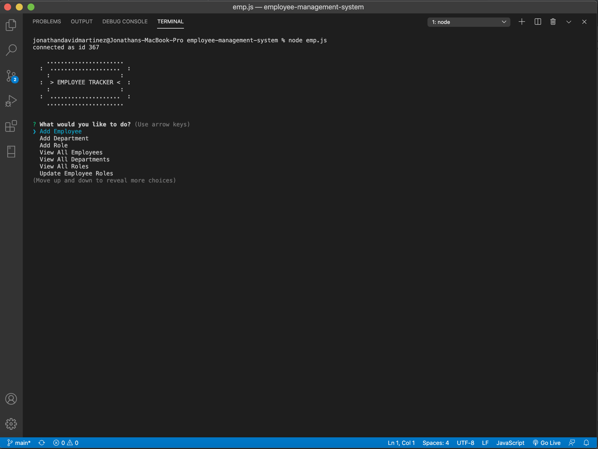
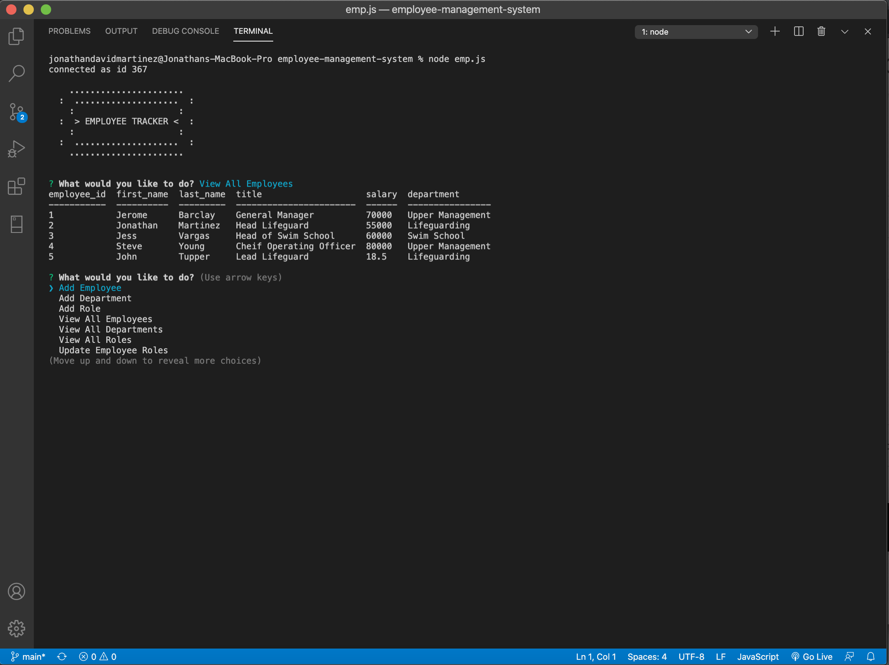
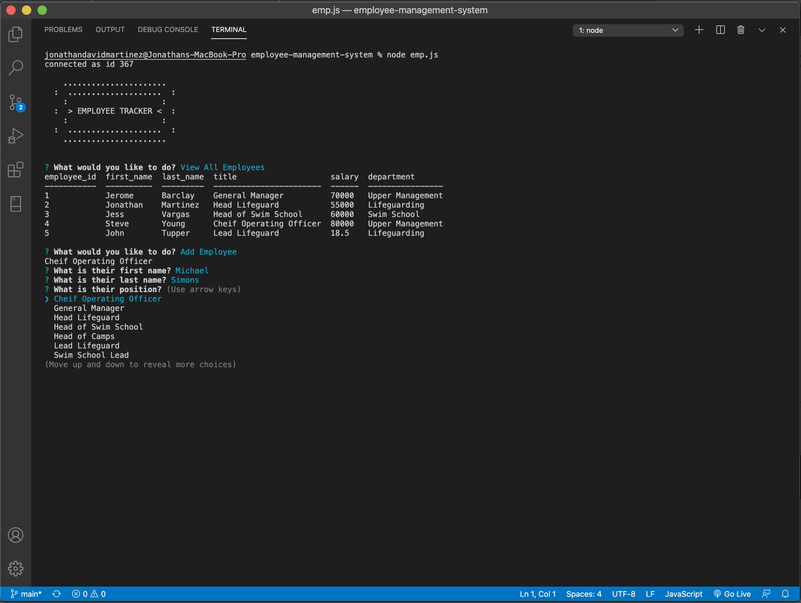
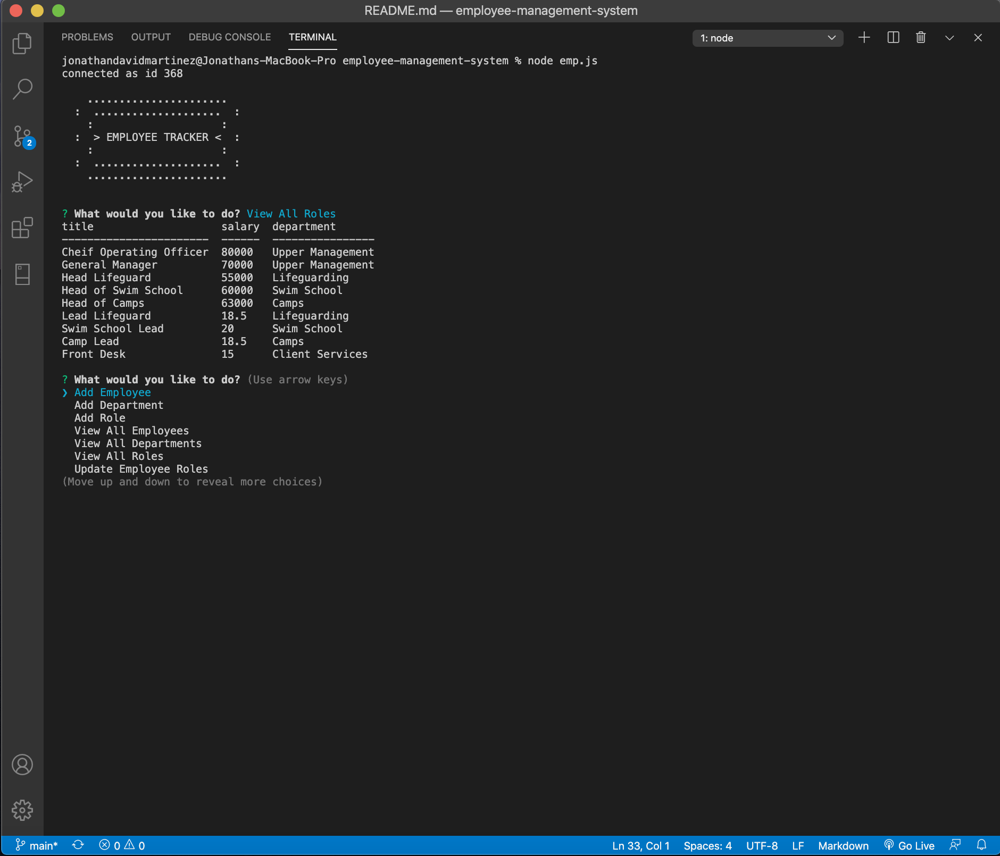

# employee-management-system

[](https://opensource.org/licenses/MIT)
[](https://shields.io/)
[](https://shields.io/)
[](https://shields.io/)


## Description

This is commandline lets you keep track of your employees! Add employees to the database and organize your team your team by position, department, ect. View all employees to get quick overview of your teams stats!

## Table of Contents

* [Preview](#preview)

* [Installation](#installation)

* [Usage](#usage)

* [Project Significance](#project-significance)

* [Code Highlights](#code-highlights)

* [License](#license)

* [Contributing](#contributing)

* [Questions](#questions)

## Preview

<table>
  <tr>
    <td>Initial Prompt</td>
     <td>View All Employees</td>
  </tr>
  <tr>
    <td valign="top"></td>
    <td valign="top"></td>
  </tr>
  <tr>
     <td>Add A New Employee</td>
     <td>View All Roles</td>
  </tr>
  <tr>
    <td valign="top"></td>
    <td valign="top"></td>
  </tr>
 </table>

  *You can also check out a [video demonstration](NEEEDS VIDEO - PUBLISH AFTER UPLOAD)*

## Installation

To install necassary dependancies please use the following command(s): 

```
npm install mysql inquirer console.table --save
```

## Usage 

In order to use the application you will have to have download mysql and inquirer. I also recommend downloading consoel.table! It will give the application the same feel as the ones in the preview images. Once you have those installed you can initiate the application using *node emp.js*. You will also need to initialize the database on the local host 3306. please look at the code block below to make sure that you have the correct values for your instance of this application. You can use the code in *schema.sql* to create the layout of the database. If you would like to seed the database there is some executable code in *seeds.sql*

```
const connection = mysql.createConnection({
    host: "localhost",
    port: 3306,
    user: "root",
    password: "password",
    database: "emp_trackerDB"
});
```

When the database is connected you can start the application and use the prompts to navigate the application. The code is still very buggy having no validators and has limited functionality. This was an MVP. Please stay tuned for updates!

## Project Significance

This was our first project using sql! We created a database and combined it with skills that we learned in the past. It was really interesting to see how we can manipulate the data base using javascript.

## Code Highlights

This function was one of the more satisfying chunks of code to complete. It took some time to get used to JOIN in mysql. Once I was able to get that down it was then a challenge to use the foreign key of each table to effect the display of another table. This function shows how I went about manipulating the database to get desired information. 

```
function viewByDept() {
    
    connection.query("SELECT * FROM department", (err, res) => {
        let deptChoices = [];
        let deptID;

        res.forEach(res => deptChoices.push(res.department));

        inquirer
            .prompt([
                {
                    type: "list",
                    message: "What department would you like to look at?",
                    choices: deptChoices,
                    name: "deptChoice"
                }
            ])
            .then(answers => {

                res.forEach(res => {
                    if (res.department === answers.deptChoice) {
                        deptID = res.department_id;

                    };
                });

                connection.query(`SELECT employee_id, first_name, last_name, role.title
                        FROM employee INNER JOIN role ON employee.role_id=role.role_id 
                        WHERE role.department_id= ?;`, [deptID],
                    (err, res) => {
                        if (err) throw err;

                        console.table(res);
                        start();
                    });
            });
    });
};
```

## License

MIT

## Contributing

[Jonathan-David Lopez Martinez](http://www.jds.world/)

## Questions 

If you have any questions about the repo, want to open an issue or contact me directly please reach out to focus4ursoul@gmail.com. Check out more of my work at [Goodlvn](https://github.com/Goodlvn).


